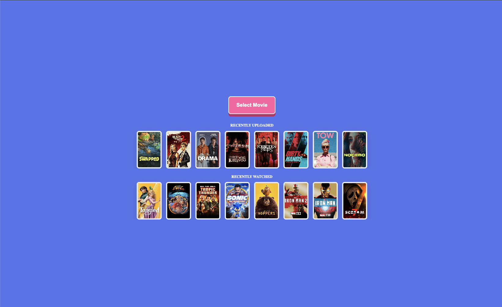

# Decidarr

May the odds be forever in your favor!

Decidarr is a Plex movie roulette app that randomly selects a movie from your library.

## Info

Decidarr is a vanilla PHP, SQLite, and JavaScript web app that connects to your Plex server, shows recently uploaded movies, and randomly selects a movie from your library.

It uses Docker, Nginx, PDO, CSRF protection, escaped output, and server-side poster proxying to help keep Plex tokens out of browser URLs.

## Features

- Help users pick movies or shows faster.
- Support household or family voting.
- Edit lists to help personalize movie selection.
- Use local or Plex-based media library information.
- Provide a clean web interface.
- Keep the app simple, local, and self-hostable.

## Screenshots




## How to run

- .env configure

```ini
PLEX_SERVER_URL=http://host.docker.internal:32400
PLEX_TOKEN=
PLEX_LIBRARY_SECTION_ID=
```

`PLEX_LIBRARY_SECTION_ID` is optional. Leave it blank to pick from any movie library.

## Storage / DB
- SQLite placed in '/storage'.
- Only stores recent movies selected.
- User credientials or tokens are stored in .env-- SQLite is schema only.

## Security 
- All database queries are prepared with binded parameters for SQL injection measures.
- Output data is HTML-escaped before rendering within the controller for XSS prevention.
- Mutating form elements require a session-baked synchronize token.
- Poster art for the movie is proxied by PHP. Avoiding the use of Plex token being public, placed in the view render output or put in the URL. Tested in Chrome, Firefox, and Librewolf. 
- SSRF Hardening. Plex URLs are limited to `http`/`https`, credentials in URLs are rejected, redirects are disabled, requests time out quickly, and cloud metadata/link-local hosts are blocked.
- Browser hardening: CSP, frame denial, nosniff, referrer policy, permissions policy, HttpOnly/SameSite session cookies.
- Data isolation: Nginx serves only `public/`; SQLite lives in `/storage`.